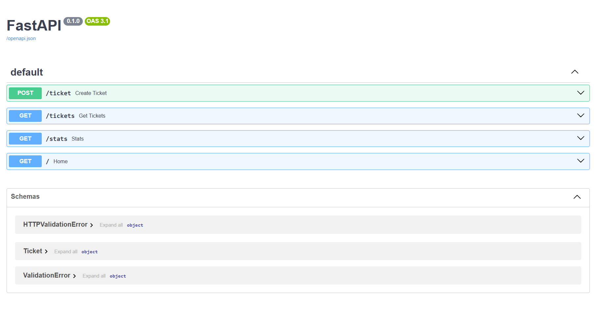
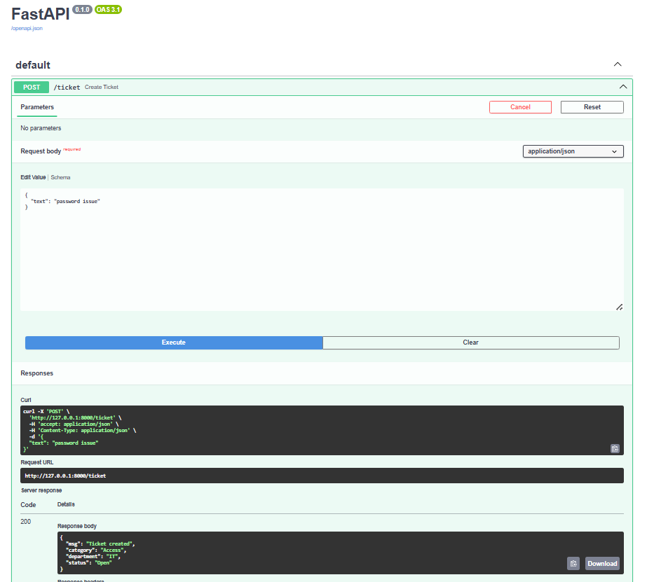
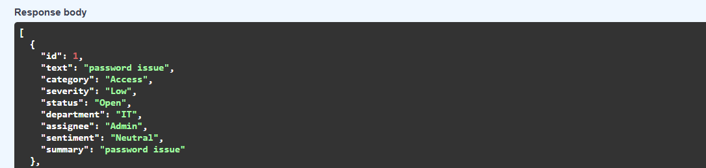

# AI Ticket Management System

## Overview
This project allows users to raise tickets like password issues, salary problems, and system bugs. It automatically analyzes the issue, classifies it, and assigns it to the appropriate department.

## Features
- Ticket creation
- AI-based classification
- Department assignment
- Employee assignment
- Analytics

## Technologies Used
- Python
- FastAPI
- SQLite
- Uvicorn

## How to Run

cd backend  
python -m uvicorn num:app  

Open:
http://127.0.0.1:8000/docs
## Screenshots

